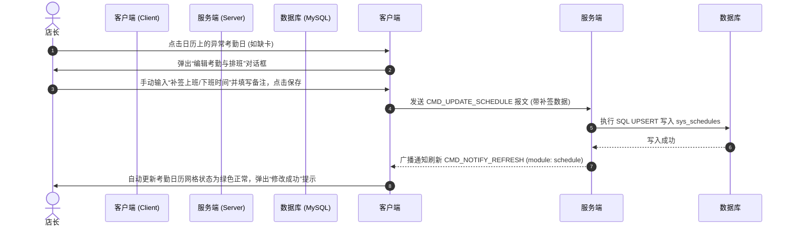

# 员工排班与刷卡考勤联动系统设计规范 (v1.1.6)

## 1. 业务背景与设计定位

### 1.1 业务背景
在宠物店的实际运营中，员工的考勤打卡采用的是外部独立的物理“刷卡系统”（硬件刷卡机）。该刷卡系统会将打卡记录自动同步写入我们 MySQL 数据库的 `sys_schedules`（排班表）中，对应的字段为 `clock_in`（上班打卡时间）和 `clock_out`（下班打卡时间）。

### 1.2 系统定位
本系统的定位是 **“完美的数据展现与补签修改平台”**，核心功能包括：
1. **考勤状态的可视化**：将排班日历与考勤打卡数据完美结合，直观展示出勤、迟到、早退、缺卡、请假、休息等六种状态。
2. **考勤的补签与纠偏**：当店员忘记刷卡、机器故障或外勤出差时，店长/管理员可以在“全景日历”上直接点击异常日期，弹窗对排班及打卡时间进行补签、修改和备注。

---

## 2. 交互界面设计 (UI/UX Design)

### 2.1 模块重组
- **移除“动态”栏**：删除员工详情抽屉（`EmployeeDetailDrawer`）中原先空洞无物的“动态”标签页。
- **引入“考勤”栏**：将“动态”标签页重构为全新的 **“考勤”** 标签页，由店长专享，提供考勤看板与日历入口。

### 2.2 考勤页（Attendance Tab）布局规范
1. **今日班次卡片**：展示今日排班时间（如 `09:00 - 18:00`），并根据当天的实际打卡情况同步展示绿色的“已打卡 (08:52)”或红色的“未打卡”状态。
2. **月度考勤全景日历**：一个 `7×5` 的日历网格，每个日期单元格中均以醒目的状态徽章回显当天的打卡时间或状态：
   - 🟢 **绿色 (正常)**：按时打卡，如 `08:52`。
   - 🟠 **橙色 (迟到/早退)**：超出计划上下班时间，分别显示“迟到”或“早退”徽章。
   - 🔴 **红色 (异常缺卡)**：工作日未检测到打卡数据，显示“缺卡”徽章。
   - 🔘 **灰色 (休息/请假)**：排班为休息或请假，显示“休息”或“请假”徽章。
3. **月度考勤摘要看板**：在最底部统计展示“本月正常出勤天数”、“本月迟到/早退次数”、“本月未打卡天数”、“本月休息天数”。

### 2.3 视觉交互原型预览
以下为我们精心设计的考勤管理日历及手动补签修改弹窗的设计原型效果：


---

## 3. 数据库与数据结构设计 (Database & Data Structures)

### 3.1 数据库结构
本系统直接复用 `sys_schedules` 表中的字段，无需修改表结构。相关字段定义如下：

| 字段名 | 类型 | 允许 Null | 默认值 | 商业逻辑说明 |
| :--- | :--- | :--- | :--- | :--- |
| **schedule_id** | int | 否 | 自增 | 主键 ID |
| **emp_id** | int | 否 | - | 关联员工 ID |
| **work_date** | date | 否 | - | 工作日期 (yyyy-MM-dd) |
| **shift_type** | enum | 否 | - | 班次类型 ('休息', '早班', '晚班', '自定义') |
| **plan_start** | time | 是 | NULL | 计划上班时间 (如 09:00:00) |
| **plan_end** | time | 是 | NULL | 计划下班时间 (如 18:00:00) |
| **clock_in** | datetime | 是 | NULL | 实际打卡上班时间 (补签写入) |
| **clock_out** | datetime | 是 | NULL | 实际打卡下班时间 (补签写入) |
| **note** | varchar | 是 | NULL | 考勤补签/异常备注 (如“忘记带卡，店长补签”) |

### 3.2 客户端结构体扩展 (`common_types.h`)
在客户端的 `ScheduleInfo` 结构体中扩展考勤所需的打卡时间及备注字段：
```cpp
struct ScheduleInfo {
    QString employeeId;
    QString date;       // yyyy-MM-dd
    ShiftType type;
    QString startTime;  // HH:mm
    QString endTime;    // HH:mm
    QString clockIn;    // HH:mm (新增，空为未打卡)
    QString clockOut;   // HH:mm (新增，空为未打卡)
    QString note;       // 考勤补签备注
};
```

---

## 4. 网络通信协议规范 (Network API Protocols)

### 4.1 获取排班与考勤数据 (`CMD_GET_SCHEDULE`)
- **请求包 (Client -> Server)**:
  ```json
  {
    "start_date": "2026-05-01",
    "end_date": "2026-05-31"
  }
  ```
- **响应包 (Server -> Client)**:
  ```json
  {
    "status": 200,
    "data": [
      {
        "emp_id": "E002",
        "work_date": "2026-05-16",
        "shift_type": "早班",
        "plan_start": "09:00:00",
        "plan_end": "18:00:00",
        "clock_in": "",
        "clock_out": "",
        "note": "忘记刷卡，待补签"
      },
      {
        "emp_id": "E002",
        "work_date": "2026-05-17",
        "shift_type": "早班",
        "plan_start": "09:00:00",
        "plan_end": "18:00:00",
        "clock_in": "2026-05-17 08:52:00",
        "clock_out": "2026-05-17 18:04:00",
        "note": "今天正常"
      }
    ]
  }
  ```

### 4.2 保存/修改考勤补签数据 (`CMD_UPDATE_SCHEDULE`)
- **请求包 (Client -> Server)**:
  ```json
  {
    "emp_id": "E002",
    "work_date": "2026-05-16",
    "shift_type": "早班",
    "plan_start": "09:00:00",
    "plan_end": "18:00:00",
    "clock_in": "2026-05-16 08:55:00",
    "clock_out": "2026-05-16 18:02:00",
    "note": "忘记刷卡，店长代补签"
  }
  ```
- **响应包 (Server -> Client)**:
  ```json
  {
    "status": 200,
    "message": "success"
  }
  ```

---

## 5. 核心逻辑流程



---

## 6. 测试与质量控制规范

1. **外键约束测试**：确保修改不存在排班记录的日期时，`ON DUPLICATE KEY UPDATE` 能够正常执行插入，且插入的 `emp_id` 外键与 `sys_employees` 严格一致。
2. **异常状态展示测试**：
   - 迟到边界值：计划 `09:00` 上班，打卡 `09:00`（正常），打卡 `09:01`（迟到）。
   - 早退边界值：计划 `18:00` 下班，打卡 `18:00`（正常），打卡 `17:59`（早退）。
3. **空值与清除处理测试**：支持将打卡时间修改为空，以便撤销补签记录。
